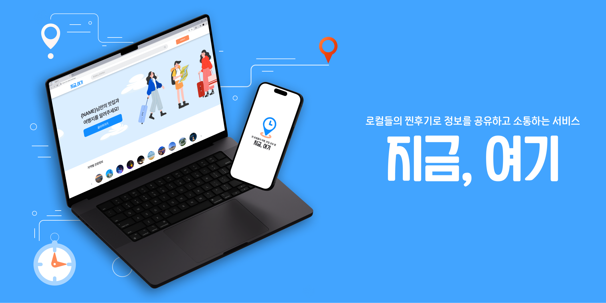
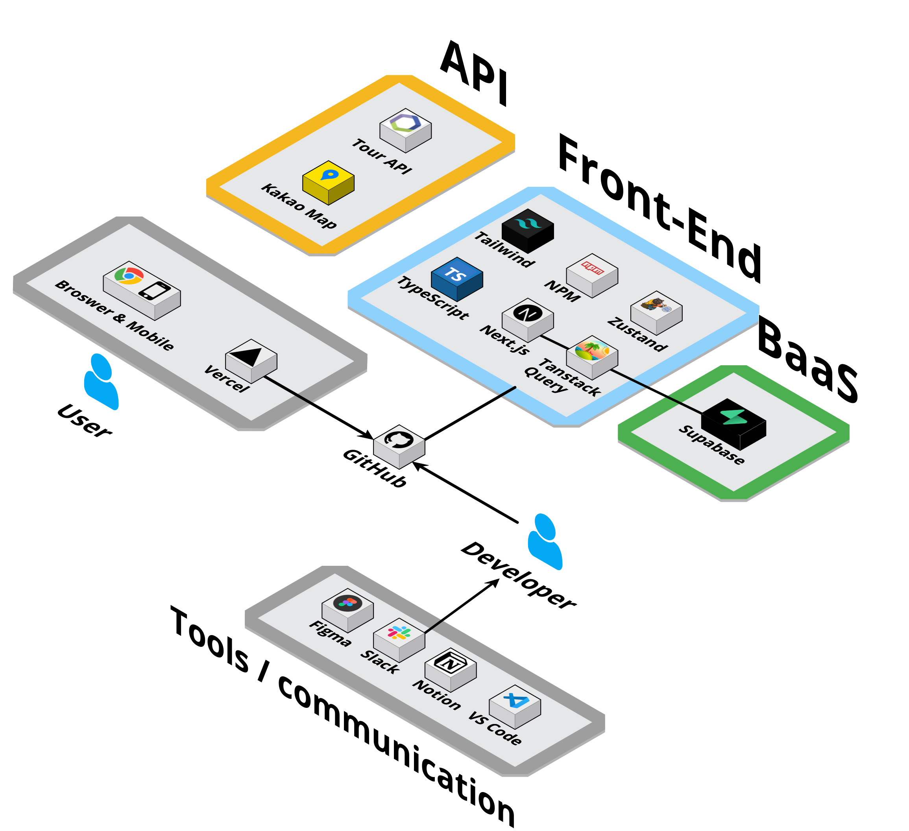

# ✈️ 프로젝트명 : 지금, 여기

<br/>
<p align="center">

</p>
<br/>

# 소개

## 1. 프로젝트 소개

## 2. 프로젝트 진행

## 3. 프로젝트 대표기능

## 4. 트러블 슈팅

  <br/>
  
  <br/>

# 1. 프로젝트 소개

<br/>
  
## 🐬 로컬의 생생한 순간을 당신의 손안에! “지금, 여기”
### 🚴여행을 계획하면서 현지의 생생한 정보를 얻고 싶었던 적이 있으신가요? <br/> 
&nbsp;&nbsp;&nbsp;&nbsp;&nbsp;**"지금, 여기" 만 있으면 헛걸음 걱정은 이제 끝!** <br/>
-  “지금, 여기” 에서 현지의 여행지, 맛집, 행사 정보를 실시간으로 확인하고 다른 사용자들과 소통하며 필요한 정보를 나눌 수 있어요.
- 사용자는 현재 위치 또는 관심 있는 로컬의 맛집, 여행지, 행사, 날씨, 사용자 후기 등을 확인하고, 다른 사용자들과 정보를 공유하며 소통할 수 있습니다.
- 사용자 각자의 여행 경험이 쌓이고 공유되어, 더 많은 사람이 만족할 수 있는 여행을 즐길 수 있습니다.
- "지금, 여기"만 있으면 헛걸음 걱정은 이제 끝! 각자의 여행 경험이 쌓이고 공유되어, 더 많은 사람이 만족할 수 있는 여행을 즐길 수 있습니다.
  <br/>

<br/>

## 🔍 아키텍처

<br/>

<p align="center">

</p>

<br/>
<br/>

## 📚 Stacks

#### 🌐 Package Manager


#### 💻 Front-end

  

#### 💾 Back-end


#### 📁 State management

 

#### 🏢 Distribution


#### ✅ API

```
한국관광공사 Tour API, 카카오 지도 API
```

#### ✅ JavaScript-Library

```react
react-toastify, day.js, react-intersection-observer, heroicons, react-kakao-maps-sdk
```

<br/>

<br/>

## 📖 기술적 의사결정

<details>
  <summary>
    <strong>Framework</strong>
  </summary>
<br/>
  
  **Next.js**
  
Next.js는 Server-Side Rendering 방식으로 동작하므로, 서버에서 데이터를 보내 빈 브라우저에 페이지를 만드는 CSR과 달리 페이지를 다 채우고 브라우저 
에 보내는 방식으로 렌더링이 진행됩니다. 따라서 SEO(검색 엔진 최적화)에 유리하고, CSR도 가능하기 때문에 선택의 폭이 넓습니다.
</details>

<details>
  <summary><strong>Programming</strong></summary>
<br/>
  
  **TypeScript**
  
자바스크립트에서 타입 시스템이 더해진 언어로 정적 타이핑이 가능합니다. 굳이 직접 실행하지 않고도 컴파일 시점에 오류를 체크할 수 있었고, 자동 완성이라는 편리한 기능을 통해 오타로 인한 실수도 현저히 줄일 수 있습니다.
</details>

<details>
  <summary><strong>Database</strong></summary>
  <br/>
  
  **Supabase**
  
데이터베이스와 API 를 구축하는데 필요한 설정, 관리와 시간을 최소화 하여 프론트엔드 개발에 집중할 수 있게 도와주는 오픈소스 벡엔드 서비스입니다. Supabase는 서버리스 환경에서 강력한 백엔드 서비스를 제공하며, 추가로 Authentication 기능은 사용자 인증 및 관리를 간편하게 처리할 수 있는 모듈을 갖추고 있습니다.
</details>

<details>
  <summary><strong>Deployment Platform</strong></summary>
<br/>
  
  **Vercel**
  
Next.js의 제작사에서 제공하는 배포 플랫폼으로, 서버리스 환경에서 빠르고 안정적인 배포를 지원합니다. 자동화된 CI/CD(Continuous Integration/Continuous Deployment) 파이프라인을 통해 코드를 푸시하면 자동으로 배포가 이루어지며, 성능 최적화 기능과 전역 CDN(Content Delivery Network)을 제공하여 빠른 로딩 속도를 보장합니다. 또한, 프로젝트의 도메인 관리와 SSL 인증서 발급을 간편하게 처리할 수 있는 기능을 갖추고 있습니다.
</details>

<details>
  <summary><strong>State Management Libraries</strong></summary>
 <br/>
     
  **TanStack Query**
  
fetch 요청 시 로딩, 에러, 성공의 상태 정보를 얻을 수 있어 서버 상태 관리가 용이합니다. 유니크한 key값을 이용해 데이터를 저장하여 특정 데이터 쿼리에 대한 조회 및 무효화를 쉽게 할 수 있으며, 동일한 네트워크 요청 발생 시 쿼리키에 캐싱된 값을 사용하여 불필요한 네트워크 
재요청을 방지할 수 있습니다. 또한, 무한 스크롤 기능을 통해 데이터를 페이지네이션 없이 연속적으로 로드할 수 있고, 낙관적 업데이트를 통해 좋아요와 같은 상호작용에 대해 빠른 사용자 피드백을 제공할 수 있습니다. 이런 기능들은 사용자 경험을 향상시키고, 성능 최적화에도 큰 
도움이 됩니다.

**Zustand**

타입스크립트 기반의 경량 전역 상태 관리 라이브러리로, 단순한 API와 빠른 성능이 특징입니다. Redux의 Flux 아키텍처를 채택하여
기존에 Redux를 사용하던 팀원들에게 친숙한 환경을 제공합니다. 보일러 플레이트가 간단하여 빠르게 설정할 수 있으며, 선언적이고 직관적인 상태 관리를 통해 코드 가독성을 높여줍니다. 또한, React와의 완벽한 호환성 덕분에 컴포넌트 기반의 개발에 유연하게 적용할 수 있습니다.

</details>

<details>
  <summary><strong>Styling</strong></summary>
 <br/>
     
  **Tailwind CSS**
  
일관된 클래스명으로 코드의 의도를 명확하게 전달 가능하며 유지 보수가 용이합니다. 미리 정의된 유틸리티 클래스를 사용하기 때문에 빠른 
디자인 가능하며 렌더링 속도, 성능 면에서 다른 CSS 방식보다 유리하고 Next.js에서 권장하는 CSS 라이브러리로서 원활하게 사용할 수 있습니다.

**React-Toastify**

사용자에게 피드백을 제공하기 위한 알림 메시지를 쉽게 구현할 수 있는 React 라이브러리입니다. 다양한 커스터마이징 옵션과 함께 간단한 API를 제공하여 프로젝트에 빠르게 통합할 수 있습니다. 특히, Next.js와 같은 서버 사이드 렌더링 환경에서도 문제없이 동작하며, 사용자 경험을
향상시키는 데 유용합니다.

**Heroicons**

Tailwind CSS 팀이 제공하는 아이콘 라이브러리로, 무료로 사용할 수 있는 다양한 SVG 아이콘을 제공합니다. React 컴포넌트 형태로 제공되기 때문에 Next.js 프로젝트에 쉽게 통합할 수 있으며, Tailwind CSS와 함께 사용하면 일관된 디자인 시스템을 구축하는 데 도움이 됩니다.

</details>

  <br/>

## 📂 프로젝트 폴더 구조

<details>
  <summary><strong>폴더 구조</strong></summary>
  <br />

📦src<br/>
┣ 📂app<br/>
┃ ┣ 📂(layout)<br/>
┃ ┃ ┣ 📂(feed)<br/>
┃ ┃ ┃ ┗ 📂feed<br/>
┃ ┃ ┃ ┃ ┣ 📜loading.tsx<br/>
┃ ┃ ┃ ┃ ┗ 📜page.tsx<br/>
┃ ┃ ┣ 📂(local)<br/>
┃ ┃ ┃ ┗ 📂local<br/>
┃ ┃ ┃ ┃ ┣ 📂details<br/>
┃ ┃ ┃ ┃ ┃ ┗ 📂[id]<br/>
┃ ┃ ┃ ┃ ┃ ┃ ┗ 📜page.tsx<br/>
┃ ┃ ┃ ┃ ┗ 📂[region]<br/>
┃ ┃ ┃ ┃ ┃ ┗ 📜page.tsx<br/>
┃ ┃ ┣ 📂feed-detail<br/>
┃ ┃ ┃ ┗ 📂[id]<br/>
┃ ┃ ┃ ┃ ┗ 📜page.tsx<br/>
┃ ┃ ┣ 📂profile<br/>
┃ ┃ ┃ ┗ 📂[id]<br/>
┃ ┃ ┃ ┃ ┗ 📜page.tsx<br/>
┃ ┃ ┣ 📂search-page<br/>
┃ ┃ ┃ ┣ 📜layout.tsx<br/>
┃ ┃ ┃ ┗ 📜page.tsx<br/>
┃ ┃ ┣ 📜layout.tsx<br/>
┃ ┃ ┗ 📜page.tsx<br/>
┃ ┣ 📂(webmain)<br/>
┃ ┃ ┣ 📂webmain<br/>
┃ ┃ ┃ ┗ 📜page.tsx<br/>
┃ ┃ ┣ 📂websearch-page<br/>
┃ ┃ ┃ ┗ 📜page.tsx<br/>
┃ ┃ ┣ 📂_componets<br/>
┃ ┃ ┃ ┣ 📂AroundLocalList<br/>
┃ ┃ ┃ ┃ ┣ 📜AroundLocalItem.tsx<br/>
┃ ┃ ┃ ┃ ┣ 📜AroundLocalList.tsx<br/>
┃ ┃ ┃ ┃ ┗ 📜index.ts<br/>
┃ ┃ ┃ ┣ 📂LocalCategory<br/>
┃ ┃ ┃ ┃ ┣ 📜index.ts<br/>
┃ ┃ ┃ ┃ ┗ 📜LocalCategory.tsx<br/>
┃ ┃ ┃ ┣ 📂LocalFeedList<br/>
┃ ┃ ┃ ┃ ┣ 📜FeedItem.tsx<br/>
┃ ┃ ┃ ┃ ┣ 📜index.ts<br/>
┃ ┃ ┃ ┃ ┗ 📜LocalFeedList.tsx<br/>
┃ ┃ ┃ ┣ 📜MainBanner.tsx<br/>
┃ ┃ ┃ ┣ 📜searchStore.ts<br/>
┃ ┃ ┃ ┣ 📜WebFeedCategories.tsx<br/>
┃ ┃ ┃ ┣ 📜WebFeedItem.tsx<br/>
┃ ┃ ┃ ┣ 📜WebFeedSearchItem.tsx<br/>
┃ ┃ ┃ ┣ 📜WebFooter.tsx<br/>
┃ ┃ ┃ ┣ 📜WebHeader.tsx<br/>
┃ ┃ ┃ ┣ 📜WebMainBar.tsx<br/>
┃ ┃ ┃ ┣ 📜WebRecentSearch.tsx<br/>
┃ ┃ ┃ ┣ 📜WebSearch.tsx<br/>
┃ ┃ ┃ ┣ 📜WebSearchCategories.tsx<br/>
┃ ┃ ┃ ┗ 📜WebSearchItem.tsx<br/>
┃ ┃ ┗ 📜layout.tsx<br/>
┃ ┣ 📂api<br/>
┃ ┃ ┣ 📂additional-details<br/>
┃ ┃ ┃ ┗ 📂[id]<br/>
┃ ┃ ┃ ┃ ┗ 📜route.ts<br/>
┃ ┃ ┣ 📂check-email<br/>
┃ ┃ ┃ ┗ 📜route.ts<br/>
┃ ┃ ┣ 📂like-place<br/>
┃ ┃ ┃ ┗ 📜route.ts<br/>
┃ ┃ ┣ 📂local-details<br/>
┃ ┃ ┃ ┗ 📂[id]<br/>
┃ ┃ ┃ ┃ ┗ 📜route.ts<br/>
┃ ┃ ┣ 📂local-event<br/>
┃ ┃ ┃ ┗ 📂[id]<br/>
┃ ┃ ┃ ┃ ┗ 📜route.ts<br/>
┃ ┃ ┣ 📂local-list<br/>
┃ ┃ ┃ ┗ 📂[id]<br/>
┃ ┃ ┃ ┃ ┗ 📜route.ts<br/>
┃ ┃ ┣ 📂nearby-places<br/>
┃ ┃ ┃ ┗ 📜route.ts<br/>
┃ ┃ ┣ 📂search<br/>
┃ ┃ ┃ ┗ 📜route.ts<br/>
┃ ┃ ┣ 📂sign-in<br/>
┃ ┃ ┃ ┣ 📂callback<br/>
┃ ┃ ┃ ┃ ┗ 📜route.ts<br/>
┃ ┃ ┃ ┗ 📜route.ts<br/>
┃ ┃ ┣ 📂sign-out<br/>
┃ ┃ ┃ ┗ 📜route.ts<br/>
┃ ┃ ┣ 📂sign-up<br/>
┃ ┃ ┃ ┗ 📜route.ts<br/>
┃ ┃ ┣ 📂supabase-feed<br/>
┃ ┃ ┃ ┗ 📜route.ts<br/>
┃ ┃ ┣ 📂supabase-feeduserdata<br/>
┃ ┃ ┃ ┗ 📜route.ts<br/>
┃ ┃ ┣ 📂supabase-searchfeed<br/>
┃ ┃ ┃ ┗ 📜route.ts<br/>
┃ ┃ ┣ 📂supabase-sortedfeed<br/>
┃ ┃ ┃ ┗ 📜route.ts<br/>
┃ ┃ ┗ 📜tourApi.ts<br/>
┃ ┣ 📂feed-write<br/>
┃ ┃ ┣ 📜layout.tsx<br/>
┃ ┃ ┗ 📜page.tsx<br/>
┃ ┣ 📂sign-in<br/>
┃ ┃ ┗ 📜page.tsx<br/>
┃ ┣ 📂sign-up<br/>
┃ ┃ ┗ 📜page.tsx<br/>
┃ ┣ 📜globals.css<br/>
┃ ┣ 📜layout.tsx<br/>
┃ ┗ 📜not-found.tsx<br/>
┣ 📂components<br/>
┃ ┣ 📂FeedDetail<br/>
┃ ┃ ┣ 📜Comments.tsx<br/>
┃ ┃ ┣ 📜DetailLikeBtn.tsx<br/>
┃ ┃ ┣ 📜FeedDetailSkeleton.tsx<br/>
┃ ┃ ┗ 📜PopularPosts.tsx<br/>
┃ ┣ 📂FeedList<br/>
┃ ┃ ┣ 📜FeedItemSkeleton.tsx<br/>
┃ ┃ ┣ 📜FeedListClient.tsx<br/>
┃ ┃ ┣ 📜FeedListItem.tsx<br/>
┃ ┃ ┣ 📜HeartIconSolid.tsx<br/>
┃ ┃ ┗ 📜UserName.tsx<br/>
┃ ┣ 📂FeedWrite<br/>
┃ ┃ ┣ 📜ContentInput.tsx<br/>
┃ ┃ ┣ 📜ImageUpload.tsx<br/>
┃ ┃ ┣ 📜LocationButton.tsx<br/>
┃ ┃ ┣ 📜LocationDropdown.tsx<br/>
┃ ┃ ┗ 📜TitleInput.tsx<br/>
┃ ┣ 📂Footer<br/>
┃ ┃ ┣ 📜Footer.tsx<br/>
┃ ┃ ┗ 📜index.ts<br/>
┃ ┣ 📂FooterMain<br/>
┃ ┃ ┗ 📜FooterMain.tsx<br/>
┃ ┣ 📂HeaderLayout<br/>
┃ ┃ ┗ 📜HeaderLayout.tsx<br/>
┃ ┣ 📂HeaderMain<br/>
┃ ┃ ┗ 📜HeaderMain.tsx<br/>
┃ ┣ 📂HomeMain<br/>
┃ ┃ ┗ 📜HomeMain.tsx<br/>
┃ ┣ 📂IconList<br/>
┃ ┃ ┣ 📜PenIcon.tsx<br/>
┃ ┃ ┗ 📜PostIcon.tsx<br/>
┃ ┣ 📂LocalDetails<br/>
┃ ┃ ┣ 📜Details.tsx<br/>
┃ ┃ ┣ 📜KakaoMap.tsx<br/>
┃ ┃ ┣ 📜LikeBtn.tsx<br/>
┃ ┃ ┣ 📜LocalDetailsSkeleton.tsx<br/>
┃ ┃ ┗ 📜NearbyPlaces.tsx<br/>
┃ ┣ 📂LocalList<br/>
┃ ┃ ┣ 📜ContentTypeFilter.tsx<br/>
┃ ┃ ┣ 📜InfiniteScroll.tsx<br/>
┃ ┃ ┣ 📜LoadingState.tsx<br/>
┃ ┃ ┣ 📜LocalListItem.tsx<br/>
┃ ┃ ┣ 📜LocalListPage.tsx<br/>
┃ ┃ ┣ 📜RegionHeader.tsx<br/>
┃ ┃ ┗ 📜SkeletonCard.tsx<br/>
┃ ┣ 📂MainPage<br/>
┃ ┃ ┣ 📂api<br/>
┃ ┃ ┃ ┗ 📜searchApi.ts<br/>
┃ ┃ ┣ 📂Header<br/>
┃ ┃ ┃ ┣ 📜Header.tsx<br/>
┃ ┃ ┃ ┗ 📜index.ts<br/>
┃ ┃ ┣ 📂Main<br/>
┃ ┃ ┃ ┣ 📂Sections<br/>
┃ ┃ ┃ ┃ ┣ 📜CheckLoginUser.tsx<br/>
┃ ┃ ┃ ┃ ┣ 📜LocalItem.tsx<br/>
┃ ┃ ┃ ┃ ┣ 📜LocalItemList.tsx<br/>
┃ ┃ ┃ ┃ ┣ 📜LocalSection.tsx<br/>
┃ ┃ ┃ ┃ ┣ 📜WebFeedItem.tsx<br/>
┃ ┃ ┃ ┃ ┗ 📜WebFeedSection.tsx<br/>
┃ ┃ ┃ ┣ 📜index.ts<br/>
┃ ┃ ┃ ┗ 📜Main.tsx<br/>
┃ ┃ ┣ 📂SearchElements<br/>
┃ ┃ ┃ ┣ 📜SearchFeed.tsx<br/>
┃ ┃ ┃ ┣ 📜SearchFeedItem.tsx<br/>
┃ ┃ ┃ ┣ 📜SearchFilterItem.tsx<br/>
┃ ┃ ┃ ┣ 📜SearchForm.tsx<br/>
┃ ┃ ┃ ┣ 📜SearchIntroduction.tsx<br/>
┃ ┃ ┃ ┗ 📜SearchItem.tsx<br/>
┃ ┃ ┗ 📂Skeleton<br/>
┃ ┃ ┃ ┣ 📜SkeletonFeedItem.tsx<br/>
┃ ┃ ┃ ┣ 📜SkeletonLocalItem.tsx<br/>
┃ ┃ ┃ ┣ 📜SkeletonLocation.tsx<br/>
┃ ┃ ┃ ┣ 📜SkeletonSearchItem.tsx<br/>
┃ ┃ ┃ ┣ 📜SkeletonWebFeed.tsx<br/>
┃ ┃ ┃ ┗ 📜SkeletonWebSearch.tsx<br/>
┃ ┣ 📂Modal<br/>
┃ ┃ ┗ 📜Modal.tsx<br/>
┃ ┣ 📂MypageFeedLikesList<br/>
┃ ┃ ┗ 📜FeedLikesList.tsx<br/>
┃ ┣ 📂MypageFeedsList<br/>
┃ ┃ ┗ 📜FeedsList.tsx<br/>
┃ ┣ 📂MypagePlaceLikesList<br/>
┃ ┃ ┗ 📜PlaceLikes.tsx<br/>
┃ ┣ 📂SearchMain<br/>
┃ ┃ ┗ 📜SearchMain.tsx<br/>
┃ ┣ 📂SocialLogin<br/>
┃ ┃ ┗ 📜Sociallogin.tsx<br/>
┃ ┣ 📜DeletePrompt.tsx<br/>
┃ ┣ 📜LoadingSpinner.tsx<br/>
┃ ┣ 📜LoginPrompt.tsx<br/>
┃ ┣ 📜SendFeedWrite.tsx<br/>
┃ ┗ 📜Skeleton.tsx<br/>
┣ 📂constants<br/>
┃ ┗ 📜regionImages.ts<br/>
┣ 📂data<br/>
┃ ┗ 📜regions.json<br/>
┣ 📂fonts<br/>
┃ ┗ 📜PretendardVariable.woff2<br/>
┣ 📂hooks<br/>
┃ ┣ 📜useDebounce.ts<br/>
┃ ┣ 📜useKaKaoLoader.ts<br/>
┃ ┣ 📜useLocalDetails.ts<br/>
┃ ┗ 📜useLocalList.ts<br/>
┣ 📂providers<br/>
┃ ┣ 📜QueryProvider.tsx<br/>
┃ ┗ 📜ToastProvider.tsx<br/>
┣ 📂types<br/>
┃ ┣ 📜feed.ts<br/>
┃ ┣ 📜localDetails.ts<br/>
┃ ┣ 📜localList.ts<br/>
┃ ┣ 📜mainTypes.ts<br/>
┃ ┣ 📜post.ts<br/>
┃ ┗ 📜supabase.ts<br/>
┣ 📂utils<br/>
┃ ┣ 📂supabase<br/>
┃ ┃ ┣ 📜client.ts<br/>
┃ ┃ ┣ 📜middleware.ts<br/>
┃ ┃ ┗ 📜server.ts<br/>
┃ ┣ 📜formatDate.ts<br/>
┃ ┣ 📜getRegionName.ts<br/>
┃ ┣ 📜getSigunguName.ts<br/>
┃ ┗ 📜toastHelper.ts<br/>
┣ 📂zustand<br/>
┃ ┗ 📜useAuthStore.ts<br/>
┗ 📜middleware.ts<br/>

</details>

<br/>
<br/>

## 🙂 팀원 소개

<div align="center">

|                                                                   정현우                                                                    |                                                                 강동석                                                                 |                                                                  안시승                                                                  |                                                                  박성욱                                                                   |                                                                  이세영                                                                   |                                                                 김언진                                                                 |
| :-----------------------------------------------------------------------------------------------------------------------------------------: | :------------------------------------------------------------------------------------------------------------------------------------: | :--------------------------------------------------------------------------------------------------------------------------------------: | :---------------------------------------------------------------------------------------------------------------------------------------: | :---------------------------------------------------------------------------------------------------------------------------------------: | :------------------------------------------------------------------------------------------------------------------------------------: |
| <a href="https://github.com/junghyunwoo02"></a> | <a href="https://github.com/show1486"></a> | <a href="https://github.com/Maestrossa"></a> | <a href="https://github.com/SecretCandy"></a> | <a href="https://github.com/leeseayoung"></a> | <a href="https://github.com/EONNI107"></a> |
|                                     피드 목록페이지<br/>장소 목록페이지<br/>필터,무한스크롤<br/>좋아요                                      |                                      메인페이지<br/>검색결과페이지<br/>레이아웃<br/>검색기능구현                                       |                                      장소 상세페이지<br/>장소 정보,지도<br/>주변 장소<br/>댓글,API                                       |                                            피드 상세페이지<br/>좋아요,댓글<br/>피드 작성페이지                                            |                                                      로그인,회원가입<br/>마이페이지                                                       |                                                    전체적인 디자인<br/>와이어프레임                                                    |

</div>

  <br/>

  <br/>

# 2. 프로젝트 진행

<br/>

## 2024.07.16 ~ 2024.08.21<br/><br/>

<br/>

|  |  |
| :------------------------------------: | :-----------------------------------------: |

<figcaption>
  
#### 🥇 원활한 소통과 작업내용 공유를 위해 zep과 slack을 사용했어요
  
#### 🥈 코드 컨벤션을 규칙을 정해서 통일된 규칙안에서 코드를 작성해보았어요
  
#### 🥉 pr에 2명 이상의 approve가 있어야 develop에 merge를 할 수 있도록 설정했어요

</figcaption>
<br/>
<br/>

  <br/>
  <br/>

# 3. 프로젝트 대표기능

  <br/>
  
## 🧳 내 주변 여행지와 검색 기능
<div>

<figcaption>   
  <br/>
  
### 🔎 현재 위치 또는 검색을 이용하여 정보(맛집, 관광지, 행사 등)를 찾을 수 있어요.

- 사용자의 현재 위치를 기반으로 주변 여행 정보들을 보여줍니다.
- 다양한 정보를 검색을 통해 간편하고 정확하게 정보를 볼 수 있습니다.

</figcaption>
</div>
  <br/>

## 🧳 지역 캐러셀과 지역 목록 페이지

<div>

<figcaption>   
  <br/>
  
### 🗺️ 각 지역만의 정보(맛집, 여행지, 행사 등)을 한눈에 확인할 수 있어요.

- 전국 키워드를 클릭해 해당 지역들의 정보를 한눈에 확인할 수 있습니다.
- 해당 지역의 여행지, 맛집, 축제 및 행사 등 다양한 카테고리 별 정보를 찾을 수 있습니다.
- 해당 장소를 누르면 상세 페이지로 이동합니다

</figcaption>
</div>
  <br/>

## 🧳 장소 상세 페이지

<div>

<figcaption>   
  <br/>
  
### 🚩 해당 장소의 정보를 자세하게 볼 수 있어요.

- 좋아요와 공유, 댓글 기능으로 사람들과 소통할 수 있습니다.
- 해당 장소에 대한 위치를 카카오 맵으로 마커로 표시합니다.
- 카테고리 타입에 맞는 주변 장소를 추천합니다.

</figcaption>
</div>
  <br/>

## 🧳 피드 상세 페이지

<div>

<figcaption>   
  <br/>
  
### 🔖 사람들과 피드에서 마음의 드는 장소를 공유할 수 있어요.

- 좋아요와 공유, 댓글 기능으로 사람들과 소통할 수 있습니다.
- 해당 장소에 대한 위치를 표시하여 어디인지 확인하고, 클릭하면 해당 장소 목록 페이지로 이동합니다.

</figcaption>
</div>
  <br/>

## 🧳 피드 목록과 작성 페이지

<div>

<figcaption>   
  <br/>
  
### ✍🏻 자신만의 피드를 작성하여 여행 이야기를 남겨보세요.

- 사용자가 특정 지역에 대한 게시글을 업로드해 장소의 정보와 경험을 공유합니다.
- 등록된 글을 지역 별로, 최신순, 댓글순, 찜한순으로 볼 수 있습니다.
- 피드를 작성하거나 찜하면 마이페이지에서 확인할 수 있습니다.

</figcaption>
</div>
  <br/>

## 🧳 마이 페이지

<div>

<figcaption>   
  <br/>
  
### 😎 사용자의 정보와 내가 찜한 컨텐츠들을 확인할 수 있어요.

- 닉네임과 프로필 사진을 변경할 수 있습니다.
- 내가 찜한 피드 게시글과 작성한 글, 장소 등을 확인할 수 있습니다.

</figcaption>
</div>
  <br/>
  
  <br/>


# 4. 트러블 슈팅

  <br/>
 <details>
  <summary>
    <strong>1. Database Error와 트리거 설정 수정</strong>
  </summary>
<br/>
  
  **❌ 문제**
  
"Database error saving new user"라는 에러 메시지가 계속 나타났습니다. 유저 테이블을 public 유저로 복사하는 과정에서 생긴 오류.

**✅ 해결**

초기 트리거 설정이 잘못되어 DROP FUNCTION 코드를 사용해 삭제한 후,
다시 설정하여 오류를 수정했습니다.

<details>
  <summary>🖱️ 코드</summary>

```js
create or replace function public.handle_new_user()
returns trigger
language plpgsql
security definer set search_path = ''
as $$
begin
  insert into public."Users" (id, email, nickname, provider)
  values (
    new.id, new.email,
    new.raw_user_meta_data->>'name',
    new.raw_app_meta_data->>'provider'
  );
  return new;
end;
$$;
```

</details>
</details>
 
 <details>
  <summary>
    <strong>2. 관광 API 데이터에서 특정 관광지 지도 렌더링 문제</strong>
  </summary>
<br/>
  
  **❌ 문제**
  
관광 API 데이터에서 위도와 경도를 받아와 카카오맵에 표시할 때, 특정 관광지만 지도에 마커가 보이고 지도 자체는 렌더링되지 않았습니다. 관광 API가 잘못된 좌표 데이터를 제공하고 있었습니다.

**✅ 해결**

해당 문제를 해결하기 위해, 데이터베이스를 직접 수정할 수 없는 상황에서 다음과 같은 접근 방식이 적용되었습니다. API 데이터가 우리나라 국토의 좌표 범위를 벗어나는 경우, 지도가 렌더링되지 않도록 설정했습니다. 이 방식으로 문제를 효과적으로 해결할 수 있었습니다.

 </details>

 <details>
  <summary>
    <strong>3.페이지 내 두 개의 API 엔드포인트 응답 데이터 구조 차이로 인한 타입 에러</strong>
  </summary>
<br/>
  
  **❌ 문제**
  
한 페이지에서 두 개의 서로 다른 API 엔드포인트를 호출할 때, 응답 데이터의 구조가 달라서 타입 에러가 발생했습니다. 예를 들어, zipCode 데이터는 행사 정보 데이터에 없으며, 지역 기반 정보에는 행사 시작일과 종료일 정보가 포함되어 있지 않았습니다.
  **✅ 해결**
  
응답 데이터의 구조가 크게 다르지 않음을 확인한 후, 두 데이터 구조를 통합하여 차이가 있는 부분만 옵셔널 체이닝으로 지정했습니다. 
예를 들어, zipcode?: string과 같은 방식으로 해결하여 타입 에러를 방지했습니다.
<details>
  <summary>🖱️ 코드</summary>

```js
create or replace function public.handle_new_user()
returns trigger
language plpgsql
security definer set search_path = ''
as $$
begin
  insert into public."Users" (id, email, nickname, provider)
  values (
    new.id, new.email,
    new.raw_user_meta_data->>'name',
    new.raw_app_meta_data->>'provider'
  );
  return new;
end;
$$;
```

</details>
</details>

 <details>
  <summary>
    <strong>4. 지역 이름에 하이픈이 포함된 객체 키 접근 문제</strong>
  </summary>
<br/>
  
  **❌ 문제**
  
지역 이름에 하이픈이 포함된 경우, 예를 들어 jeju-do, 이 지역 이름을 객체의 키로 사용할 때 JavaScript에서 부호가 있는 표현을 산술 연산으로 해석하려고 시도하는 문제가 발생했습니다. 이는 regionImages[params.region.toLowerCase()]와 같이 접근할 때 문제가 됩니다.

**✅ 해결**

regionImages 객체의 키를 정규화된 형태로 미리 설정하고, params.region 값을 동일한 방식으로 정규화하여 사용합니다, 이 방법을 사용하면 params.region 값을 정규화하여 모든 지역에 대해 일관되게 처리할 수 있습니다.

<details>
  <summary>🖱️코드</summary>

```js
// 예: regionImages 객체 정의
const regionImages = {
  jejudo: '/지역이미지.jpg',
  gyeonggido: '/지역이미지.jpg',
  // 다른 지역 이미지 정의
};

// 지역 이름 정규화
const normalizedRegion = params.region.toLowerCase().replace(/-/g, '');

// 정규화된 키로 이미지 선택
const selectedImage = regionImages[normalizedRegion];
```

</details>
</details>

 <details>
  <summary>
    <strong>5. 좋아요 기능 비동기 처리 관련 문제</strong>
  </summary>
<br/>
  
  **❌ 문제**
  
피드에 좋아요를 누르거나 취소할 때, UI가 즉시 업데이트되지 않거나, 좋아요 상태가 올바르게 반영되지 않는 문제 발생했습니다.

**✅ 해결**

좋아요 버튼을 클릭했을 때 즉시 UI 상태를 업데이트하고, 비동기로 서버와 통신하여 실제 좋아요 상태를 저장하도록 하였습니다.
만약 서버 통신에 실패하더라도 사용자 경험을 해치지 않도록 로컬 상태를 유지하는 방식을 도입했습니다.
Optimistic UI 업데이트: 사용자가 좋아요 버튼을 클릭했을 때, 서버 응답을 기다리지 않고 먼저 로컬 상태를 업데이트하여 UI가 즉시 반영되도록 하였습니다.
그 후 서버에 요청을 보내고, 요청이 실패하면 다시 원래 상태로 복구했습니다.

</details>

  <br/>

  <br/>
